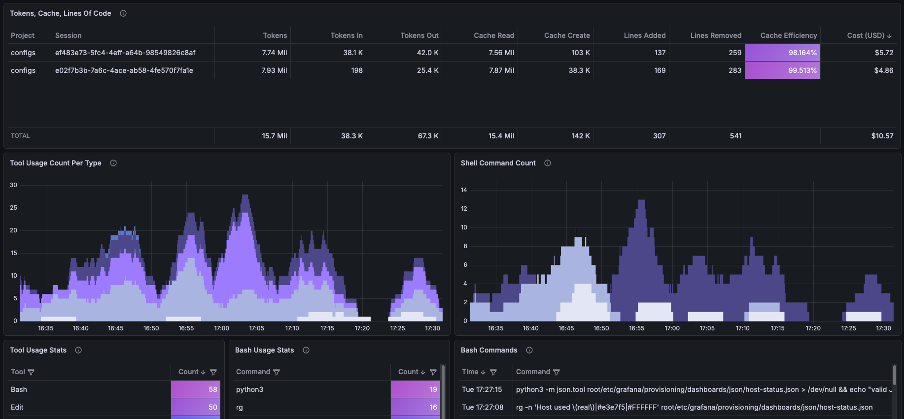
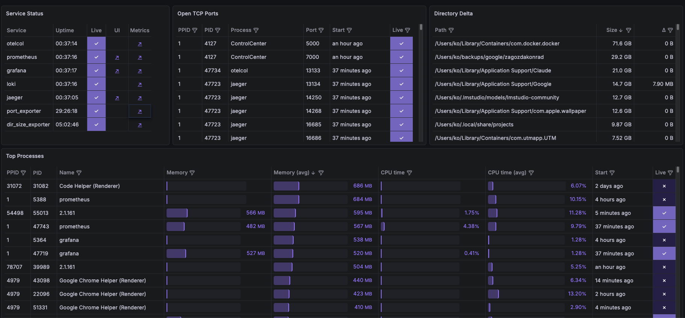

<!-- autogenerated using .repo/templates/3-audience/README.md.ontoRepo.tpl -->
## **Config**uration file**s**

## Purpose

### What It Is

Git-tracked dotfiles extended into root OS space: every option explicitly configured, scripts, observability stack. Loaded onto the host from one `root/` tree by che: symlinked by default, `.ontoHost.cp` copied, `*.ontoHost.tpl` rendered onto the host. `*.ontoRepo.tpl` renders repo docs and vm vars onto the repo.

### Why It Exists

Records a system's stateful configuration for reading and future reference, not frequent software updates: explicit configuration, modified settings separated from defaults, annotated choices.

### Goals

- Every configuration option explicit: defaults marked, modifications separated.
- One `root/` tree loads onto any supported host profile (desktop/macos, cli/macos, cli/linux).
- Generated docs stay fresh: tools inventory, Makefile doc, repo tree, agent files, README.

## Tools Inventory Index

Tool -> primary config file.

```yaml
##[>] primary
agents: profiles/llm/base/root/_home/.config/ai-agents/templates/AGENTS.md.ontoHost.tpl
ccstatusline: profiles/llm/claude/root/_home/.config/ccstatusline/settings.json
claude: profiles/llm/claude/root/_home/.config/claude/settings.json.ontoHost.tpl
codex: profiles/llm/codex/root/_home/.config/codex/config.toml.ontoHost.tpl
defaults: profiles/misc/macos/root/etc/defaults.yml
duti: profiles/misc/macos/root/etc/custom/os-open-files-with.yml
git: profiles/git/root/_home/.config/git/config
grafana: profiles/observability/grafana/root/etc/grafana/grafana.ini
jaeger: profiles/observability/jaeger/root/etc/jaeger/config.yml
kitty: profiles/dev/terminal/kitty/root/_home/.config/kitty/kitty.conf
lefthook: profiles/git/root/_home/.config/lefthook/lefthook.yml
otelcol: profiles/observability/otelcol/root/etc/otelcol/config.yml
prometheus: profiles/observability/prometheus/root/etc/prometheus/prometheus.yml
rg: profiles/shell/rg/root/etc/rg/rgrc
ssh: profiles/misc/ssh/root/_home/.ssh/config
vscode: profiles/dev/editors/vscode/mac/root/_home/Library/Application Support/Code/User/settings.json.ontoHost.tpl
zsh: profiles/shell/zsh/base/root-linux/etc/zsh/zshrc
##[<] primary

##[>] other
aws: profiles/cloud/aws/root/_home/.config/aws/config.ontoHost.tpl
azure: profiles/cloud/azure/root/_home/.config/azure/config
curl: profiles/shell/curl/root/_home/.config/curlrc
docker: profiles/dev/infra/docker/che.yml
editorconfig: profiles/dev/misc/editorconfig/root/_home/.editorconfig
gcloud: profiles/cloud/gcp/root/_home/.config/gcloud/configurations/config_main.ontoHost.tpl
gitlab-runner: profiles/gitlab/runner/root/_home/.gitlab-runner/config.toml.ontoHost.tpl
glab: profiles/gitlab/glab/root/etc/zsh/zshrc.d/auto.d/gitlab/10-auth.zsh
golang: profiles/dev/golang/che.yml
homebrew: profiles/misc/brew/root/etc/homebrew/brew.env
kind: profiles/dev/infra/kind/che.yml
kubectl: profiles/dev/infra/kubectl/che.yml
kubectx: profiles/dev/infra/kubectx/che.yml
loki: profiles/observability/loki/root/etc/loki/config.yml
man: profiles/shell/man/root/etc/man.conf
mypy: profiles/dev/python/mypy/root/_home/.config/mypy/config
nvm: profiles/dev/js/nvm/root/_home/.nvmrc
ollama: profiles/llm/ollama/root/_home/.ollama/server.json
onepassword: profiles/misc/onepassword/root/etc/zsh/zshenv.d/auto.d/onepassword/10-token.zsh
pnpm: profiles/dev/js/pnpm/che.yml
podman: profiles/dev/infra/podman/che.yml
prettier: profiles/dev/js/prettier/root/_home/.config/prettier/.prettierrc.yml
pyenv: profiles/shell/zsh/extras/root/_home/.config/zsh/zshenv.d/auto.d/extras/20-tools-env.zsh
ruby: profiles/dev/ruby/che.yml
ruff: profiles/dev/python/ruff/root/_home/.config/ruff/ruff.toml
terraform: profiles/dev/infra/terraform/che.yml
tmux: profiles/dev/terminal/tmux/root/_home/.config/tmux/tmux.conf
vim: profiles/dev/editors/vim/root/_home/.config/vim/vimrc
##[<] other
```

- [assets/data/tools-inventory-full.yml](assets/data/tools-inventory-full.yml) - Full file lists per tool.

## Observability

### Claude Code

Dashboard for Claude Code usage, cost and token metrics.



[recording](profiles/observability/grafana/assets/recordings/grafana-cc-dashboard.gif) · [more](profiles/observability/grafana/assets/images/grafana-claude-code-dashboard-pt-2.png)

### Host System

Dashboard for host CPU, memory, disk and network metrics.



[recording](profiles/observability/grafana/assets/recordings/grafana-host-dashboard.gif) · [more](profiles/observability/grafana/assets/images/grafana-host-dashboard-pt-2.png)

## Zsh **Deep** Completion

Argument completion for files & directories.


[recording](profiles/shell/zsh/assets/recordings/zsh-deep-completion.gif)

## ☢️ Danger Zone - Loading Configs ☢️

Loading configuration directly modifies the OS, including system, non-user files. If you find anything of interest, prefer copying these pieces into your own config.

[Loading Configs](assets/docs-human/loading-configuration.md)
