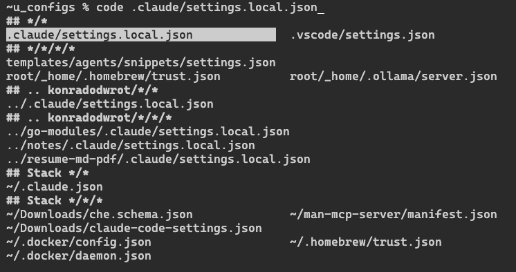

# Zsh

<!--[>] 🤖🤖 -->
## Deep Completion

Argument completion for files & directories.



[recording](assets/recordings/zsh-deep-completion.gif)
<!--[<] 🤖🤖 -->

## Deep Completion Configuration

`_deep_files` zstyle settings (`profiles/shell/zsh/base/root/etc/zsh/zshrc.d/auto.d/00-base/40-completions.zsh`).
The engine claims the empty function field of the completion context, so the
lookup context is `:completion:_deep_files:<completer>:<command>:<argument>:<group>`:
`:completion:_deep_files:*` scopes a style to every wrapped command,
`:completion:_deep_files:*:cd:*` to one command, most specific pattern wins.
Command-scoped patterns without the function field
(`:completion:*:cd:*`) keep matching.
Groups are named by a signed suffix parsed from the name: `<scope>[-N][+M]`.
`-N` anchors at the N-th ancestor of PWD, bare name = that anchor's children,
`+M` adds M depth. Unknown names are skipped silently.

Group name grammar:

| Group | Glob | Anchor |
| - | - | - |
| `pwd` | `*` | PWD |
| `pwd+1` | `*/*` | PWD |
| `pwd+2` | `*/*/*` | PWD |
| `pwd-1` | `../*` | parent |
| `pwd-1+1` | `../*/*` | parent |
| `pwd-2` | `../../*` | grandparent |
| `absolute` | `<base>/*` | typed `/` or `~` base |
| `absolute+1` | `<base>/*/*` | typed base |
| `stack` | bare `$dirstack` entries | directory stack |
| `stack+1` | `<stacked>/*` | each stacked dir |
| `stack+2` | `<stacked>/*/*` | each stacked dir |
| `named-dirs` | `hash -d` names | (none) |

Settings:

| Setting | Tag | Default | Meaning |
| - | - | - | - |
| `groups` | `:completion:_deep_files:...:` (empty tag) | `pwd`..`pwd+3`, `absolute`..`absolute+3`, `pwd-1`..`pwd-1+2`, `pwd-2` | membership + display order, the single list of groups that run |
| `file-types` | `:completion:_deep_files:...:` (empty tag) | `dirs files` | list of kinds (`dirs`, `files`) the engine globs. Membership selects kinds, list order sets per-group kind emission order (`files dirs` = files before dirs inside each group). Unknown values ignored |
| `max-hints` | `<group>` | 6, this config: `:completion:_deep_files:*:*` 6, `pwd`/`absolute`/`stack`/`named-dirs` -1, `pwd+1`/`absolute+1` 12 | group cap, shared visible+hidden+demoted. -1 uncapped, 0 disables the group (as if absent from `groups`). Narrower tag patterns override the `*` default |
| `deprioritize-hints` | `<group>` | test | segment patterns sorted last, after hidden, share the group's `max-hints`. Case-insensitive substring of any path segment, `^` pins segment start, `$` pins segment end (`'^.git$'` exact) |

Lists: `groups`, `file-types`, `deprioritize-hints`. Scalar: `max-hints`.
Per-group tags support wildcards, most specific pattern wins.
Routing: `absolute*` groups run only on a `/` or `~` prefix, `pwd*` groups
only otherwise. A bare `~name` prefix shows `named-dirs` only. `stack+M`
globs only when a pattern is typed.

Examples:

```zsh
zstyle ':completion:_deep_files:*:' groups pwd pwd+1 stack named-dirs
zstyle ':completion:_deep_files:*:cd:*:' groups pwd pwd+1 stack
zstyle ':completion:_deep_files:*:cd:*:' file-types dirs
zstyle ':completion:_deep_files:*:ls:*:' file-types files dirs
zstyle ':completion:_deep_files:*:pwd+1' max-hints 3
zstyle ':completion:_deep_files:*:pwd*' max-hints 6
zstyle ':completion:_deep_files:*:vim:*:pwd-1' deprioritize-hints '^.git$' 'node_modules'
```

Every group except `named-dirs` and base `stack` emits an `-h` hidden twin
(`pwd+1-h`) directly after it, capped together with its visible group.
